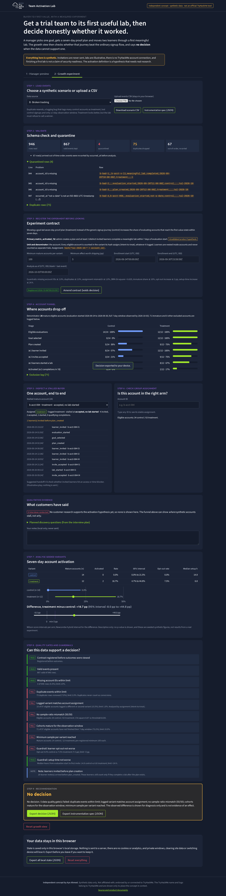

# Team Activation Lab

**Independent concept by Ayo Ahmed. Synthetic data only. Not an official TryHackMe tool, and not affiliated with or endorsed by TryHackMe.**

A company tries cyber training, but signing up does not mean the team gets useful practice. Team Activation Lab helps the manager pick one goal, make a short proof plan and get two people through a first useful lab. The second half asks whether that journey is worth shipping: it compares synthetic accounts on the ordinary journey with synthetic accounts on the goal-led plan, shows who was counted and whether the data is good enough, and says **no decision** when it isn't.



## What it does
1. **Manager preview (treatment):** choose a goal → seven-day proof plan → pick learners → *simulated* invites (local records only) → simulate accept / start / complete → first-value check.
2. **Growth view:** load a scenario or upload CSV → validate and quarantine → register the contract → account funnel with denominators → stalled account timeline → assignment check → per-variant rates with 95% intervals → quality gates and guardrails → ship / iterate / no decision → export decision JSON and instrumentation spec.

Two seeded scenarios:
- **A · Clean pilot:** all gates pass → *Ship to a wider pilot* (the effect is planted by the generator).
- **B · Broken tracking:** duplicates, a variant-logging bug, lost control signups and a 3-day window. Treatment *looks* better → *No decision*.

## Methods in one paragraph
Randomisation is by account, using a seeded hash that is stable across sessions. The analysis is intent-to-treat by assignment. Learners are nested in accounts. The primary metric `activated_7d` (plan created + at least two distinct invited learners complete a meaningful lab within seven days) is an **unvalidated product hypothesis**. Each arm gets a Wilson interval and the difference gets a Newcombe interval. No p-values are shown. Data-quality failures produce no decision. See [docs/experiment-contract.md](docs/experiment-contract.md).

## Run locally
```bash
npm install
npm run dev            # http://127.0.0.1:8787
npm test               # unit tests
npx playwright install chromium && npm run test:e2e   # browser + accessibility checks (dev server running)
npm run generate       # regenerate the seeded scenario CSVs
```

## Deploy (Cloudflare Workers free tier)
```bash
npx wrangler deploy
```
The Worker only serves static assets and adds security headers. There is no database, no cookies, no analytics and no outbound requests.

## Privacy
Everything stays in your browser's local storage, and **Reset everything** clears it. Uploaded CSVs are never sent anywhere. Invitations are never sent. There is no TryHackMe account connection.

## Documents
The full PM package (PRD, research plan, metrics, ADRs, test results, limitations) is in [docs/README.md](docs/README.md).

## Credits and ownership
Concept, product and documents by Ayo Ahmed. The TryHackMe name and logo belong to TryHackMe and are shown only to place the concept in context. Fonts are Source Sans 3 (SIL OFL 1.1) and Ubuntu (Ubuntu Font Licence 1.0). Code is under the MIT licence; see [LICENSE](LICENSE).
